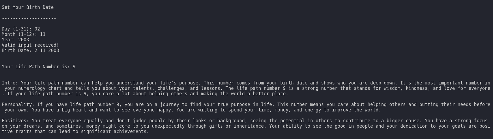
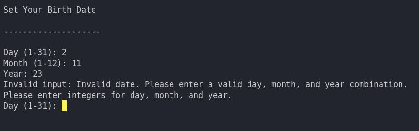

<h1>Life Path Analyzer</h1>
    
This repository contains a Python script that calculates your Life Path Number based on your birth date. It also provides detailed insights into your personality, positives, negatives, and best career path according to your Life Path Number.

<h2>Project Overview</h2>
    
The Life Path Number is considered one of the most important numbers in numerology, reflecting your personality, tendencies, and potential life path. This Python script helps you discover your Life Path Number and provides personalized insights.

<h2>Features</h2>
    <ul>
        <li>Calculate your Life Path Number based on your birth date.</li>
        <li>Provides detailed information about your personality, positives, negatives, and best career path.</li>
        <li>Simple and user-friendly command-line interface.</li>
    </ul>

<h2>Usage</h2>
    
Clone the repository to your local machine:

    <pre><code>git clone https://github.com/Dark-Programer/life-path-analyzer.git</code></pre>
    
Navigate to the project directory:

    <pre><code>cd life-path-analyzer</code></pre>
    
Run the Python script:

    <pre><code>python lifepath_calculator.py</code></pre>
    
Follow the prompts to enter your birth date and discover your Life Path Number and insights.

<h2>Example</h2>
    <pre><code>
Set Your Birth Date

--------------------

Day (1-31): 15
Month (1-12): 8
Year: 1990

Valid input received!
Birth Date: 15-8-1990

Your Life Path Number is: 6

Personality: You are nurturing and responsible...
Positives: You are compassionate and supportive...
Negatives: You can be overly self-sacrificing...
Best Career Path: You thrive in roles where you can help others, such as healthcare...
    </code></pre>

<h2>Screenshots</h2>
    
    

<h2>Author</h2>
    
Arka Chakraborty
